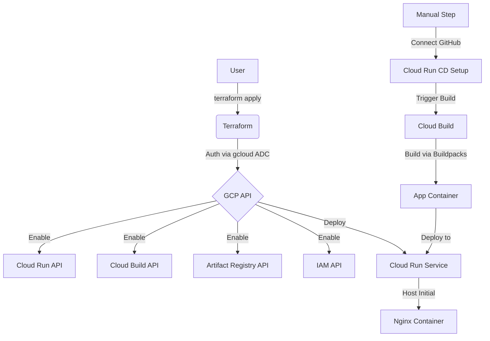
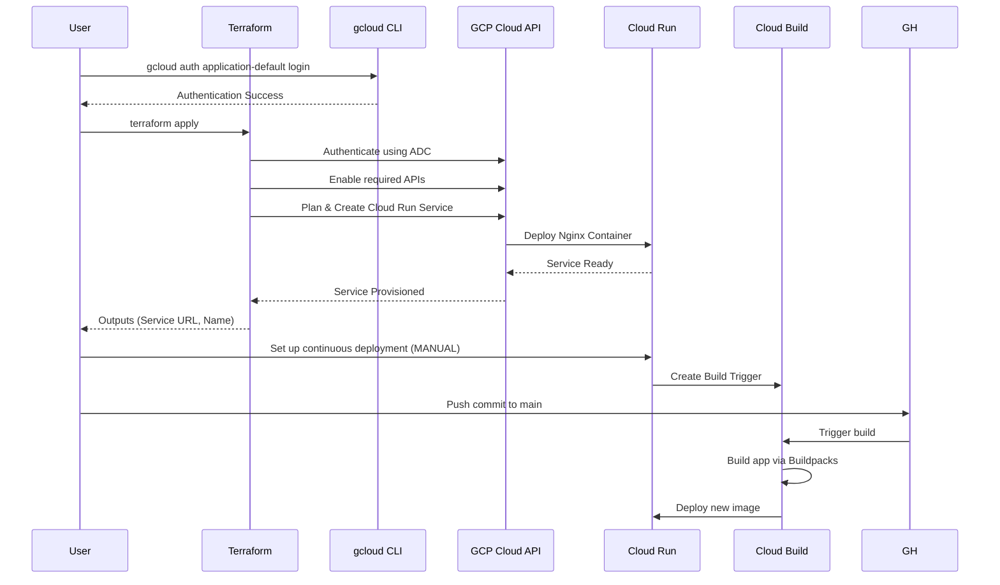

# terraform-gcp-cloudrun-repoconnect

This Terraform project provisions a Google Cloud Run service, and includes instructions to set up continuous deployment from a GitHub repository using Google Cloud Build and Buildpacks.

> **IMPORTANT**: This project is NOT fully automated! A one-time manual step is required to connect your GitHub repository (due to OAuth authorization).

## Architecture

### Flowchart



### Sequence Diagram



## Connectivity

- **Inbound Access**: Publicly accessible from the internet via the generated Service URL.
- **Outbound Access**: The container has full access to the public internet (e.g., for API calls, updates, or external dependencies).
- **Ingress Settings**: Configured to `INGRESS_TRAFFIC_ALL` to allow all external requests.

## Service Specifications

- **Initial Container Image**: `nginx:alpine` (Default placeholder).
- **Location**: Defaults to `us-central1` (can be changed via variables).
- **Scaling**: `max_instance_count` set to `1` to prevent unexpected horizontal scaling costs.
- **Resources**:
  - **CPU**: 1 vCPU (CPU only allocated during request processing).
  - **Memory**: 512 MiB.
- **Ingress**: `All` (Publicly accessible).
- **Authentication**: Unauthenticated access enabled.
- **Naming**: A random 8-character hex suffix is automatically appended to your `service_name` to ensure project-wide uniqueness.

## GCP Free Tier Limits (Always Free)

To stay within the free tier, ensure your usage does not exceed:

- **Requests**: 2 million requests per month.
- **Compute**: 360,000 vCPU-seconds and 180,000 GiB-seconds of memory per month.
- **Data Transfer**: 1 GB of outbound data transfer per month (within North America).

## Prerequisites

1.  **Google Cloud SDK**: https://cloud.google.com/sdk/docs/install
2.  **Terraform**: https://developer.hashicorp.com/terraform/downloads
3.  **GitHub Repository**: A public or private repo with your application code (Node.js, Python, Go, etc. - compatible with Google Cloud Buildpacks)

## Setup & Deployment

### Step 1: Authenticate and Select Project

Instead of using a service account JSON file, this project uses your local `gcloud` credentials.

```bash
# Authenticate
gcloud auth application-default login

# Select your project
gcloud config set project your-project-id
```

### Step 2: Configure Variables

Create a `terraform.tfvars` file based on the example:

```hcl
project_id   = "your-project-id"
region       = "us-central1"
service_name = "my-node-ts-service"
```

### Step 3: Deploy Infrastructure via Terraform

```bash
# Initialize (required to download providers)
terraform init

# Apply changes
terraform apply
```

### Step 4: Set Up Continuous Deployment (MANUAL STEP - REQUIRED)

This step CANNOT be automated via Terraform (due to GitHub OAuth authorization):

1. Go to the [GCP Console → Cloud Run](https://console.cloud.google.com/run)
2. Click on your new service (name starts with `service_name-` followed by random characters)
3. Click **Connect to repo**
4. Follow the prompts:
   - **Repository Provider**: Select "GitHub"
   - **Authenticate**: Sign in to GitHub and grant permissions to GCP
   - **Repository**: Select your GitHub repo (e.g., `marcuwynu23/node-typescript-modular-boilerplate`)
   - **Branch**: Select your default branch (e.g., `main`)
   - **Build type**: Select "Buildpacks" (use the default builder)
   - **Build context directory**: Leave as `/`
   - **Container port**: Enter the port your app listens on (common defaults: 3000 for Node.js, 8080 for many others)
5. Click **Save**

### Step 5: Trigger Your First Build

- Push a commit to your selected branch (e.g., `main`) in GitHub, OR
- Manually run the build trigger from [GCP Console → Cloud Build → Triggers](https://console.cloud.google.com/cloud-build/triggers)

### Step 6: Verify

After the build completes, visit the external URL (from Terraform outputs) to see your app running!

## Cleanup

```bash
terraform destroy
```

This will delete all resources created by Terraform. The Cloud Build trigger and GitHub connection must be deleted manually from the GCP Console if desired.

---

## Usage as a Module

Reference this repository as a Terraform module in your own configurations:

```hcl
module "cloud_run_repo" {
  source = "github.com/marcuwynu23/terraform-gcp-cloudrun-repoconnect?ref=main"

  project_id   = var.project_id
  region       = "us-central1"
  service_name = "my-app"

  github_owner = "my-org"
  github_repo_name = "my-repo"
  github_ref   = "main"
}
```

Then use the outputs in your configuration:

```hcl
# Example: pass the service URL to a load balancer
output "service_url" {
  value = module.cloud_run_repo.external_url
}
```

---

## Variables

| Variable | Description | Type | Default |
|----------|-------------|------|---------|
| `project_id` | GCP project ID | `string` | (required) |
| `region` | GCP region | `string` | `"us-central1"` |
| `service_name` | Cloud Run service name | `string` | `"node-ts-service"` |
| `github_repo_url` | GitHub repository URL | `string` | `"https://github.com/..."` |
| `developer_connect_connection_name` | Developer Connect connection name | `string` | `"github-connection"` |
| `github_owner` | GitHub repository owner | `string` | `"marcuwynu23"` |
| `github_repo_name` | GitHub repository name | `string` | `"node-typescript-modular-boilerplate"` |
| `github_ref` | GitHub reference (branch/tag/commit) | `string` | `"main"` |
| `service_account_email` | Service account email for Cloud Build | `string` | `""` |

## Outputs

| Output | Description |
|--------|-------------|
| `external_url` | External URL of the Cloud Run service |
| `service_name` | Name of the Cloud Run service |
